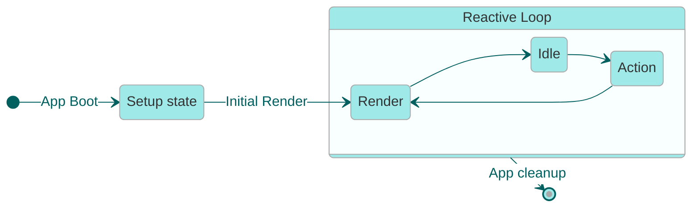

# Reactive Values

To allow developers to reason about reactive composition, developers typically interact with 
[_tags_](./concepts.md#tags) through higher-level abstractions that represent _reactive values_.

While reactive tags describe the formal _composition_ semantics of the Glimmer system, "Reactive 
Values" describe the rules that higher-level abstractions must follow in order to allow developers 
to safely reason about reactive composition.

## System Phases and the Fundamental Laws

Glimmer's reactivity system combines three key elements that work together to provide a coherent reactive programming model:

1. **A Tag-Based Validation System**: As described in [tag-composition.md](./tag-composition.md), Glimmer uses tags to track and validate dependencies without requiring value recomputation.

2. **The Fundamental Laws of Reactivity**: The [laws](./laws.md) define the contracts that all reactive abstractions must adhere to, ensuring predictable behavior when abstractions are composed.

3. **System Phases**: The system operates in distinct phases that separate mutation from validation, enabling efficient tracking while preventing inconsistencies.

These elements combine to create a system where developers can write straightforward JavaScript code while the framework maintains reactivity behind the scenes. The phases of the system, in particular, provide the framework for implementing the laws in practice.

## System Phases: A Visual Overview

- [Action Phase](#action-phase)
- [Render Phase](#render-phase)
- [Idle Phase](#idle-phase)

### Action Phase

The action phase allows app code to update reactive state in response to a system event (such as a 
promise resolution) or a user event (such as an input event or button click).

During this phase, app code is permitted to freely read and write reactive values as if they were 
normal JavaScript values. This prepares the reactive state for the next phase, the render phase.

- Root state can be updated freely, and each update advances the timeline.
- Reactive values can be accessed freely in order to decide how to update the root state.
- Reactive state is always fully coherent: reading from a reactive computation after updating one if 
  its dependencies will always return a value that is consistent with the current values of its 
  dependencies.

### Render Phase

The render phase updates the UI to reflect any changes to the reactive state.

This phase is **transactional**, which means that reactive state is _observably frozen_ for the 
duration of the render phase. Once a reactive value is accessed during a render transaction, any 
subsequent accesses will produce the same value at the same revision. 

To satisfy the requirement that reactive state is _observably frozen_ during a single render phase:

- Ember's _backtracking rerender assertion_ throws a development-mode exception if a tag that was 
  consumed during the render transaction is updated again during the transaction. _While this is not 
  enforced in production, this is a performance optimization, and the system assumes that this 
  prohibition is upheld._
- Safe reactive abstractions **must** obey the **Snapshot Immutability** law, which forbids them 
  from updating any tags during the snapshotting operation.

### Idle Phase

The idle phase represents a quiescent state where the UI is fully rendered and consistent with the current reactive state. During this phase:

- The system is waiting for the next event that will trigger state changes
- No tracking frames are active
- No updates to the reactive timeline occur

The idle phase ends when an event occurs (user interaction, network response, timer, etc.) and the
event handler updates one or more reactive values (via the `[Update]` operation on a tag). This
transition the system into the **action phase**.

The system also **schedules the render phase** to run asynchronously after the current JavaScript job
completes (consistent with JavaScript's run-to-completion semantics).

### Batched Updates with a Coherent Data Model

As a consequence of this design, all reactive updates that occur within the same JavaScript execution context are naturally batched together and processed in a single upcoming render phase. 

It's important to understand that while updates to the _rendered output_ (UI) are batched, the reactive values _inside_ the system maintain full coherence at all times:

- There is no delay between updating root state and seeing that update reflected in a computation that depends on it
- When a computation is accessed after its dependencies have changed, it will immediately recompute based on the current values
- This internal coherence ensures that JavaScript code always sees a consistent reactive state, even though UI updates are batched

This automatic batching ensures optimal performance by preventing cascading rerenders while allowing developers to work with reactive values as if they were normal JavaScript values. From the developer's perspective, reactive computations behave just like normal functions, giving them a familiar programming model with the added benefit of automatic UI updates.
